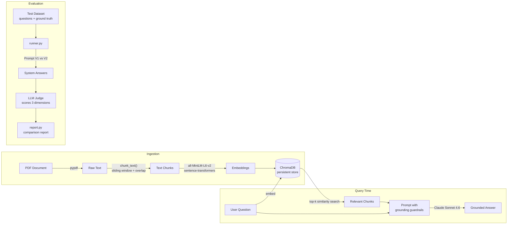

# RAG Evaluation Framework — Built From Scratch

A **Retrieval-Augmented Generation (RAG) pipeline** and a companion **LLM-as-a-Judge evaluation framework**, built entirely from scratch in Python — no LangChain, no LlamaIndex, no eval libraries. Every stage (PDF ingestion, chunking, embedding, vector search, prompt engineering, automated scoring, and reporting) is hand-written so that each design decision is deliberate and understood.

**The headline result:** a prompt-engineering A/B test, scored automatically by an LLM judge across three quality dimensions, showing the production prompt (V2) scoring **88.9%** vs a sabotaged baseline prompt (V1) at **35.2%** — proving both that the RAG system works and that the evaluation harness can reliably tell good answers from bad ones.

---

## Table of Contents

- [What This Project Does](#what-this-project-does)
- [Architecture](#architecture)
- [Part 1 — The RAG Pipeline](#part-1--the-rag-pipeline)
- [Part 2 — The Evaluation Framework](#part-2--the-evaluation-framework)
- [Results](#results)
- [Key Learnings](#key-learnings)
- [Project Structure](#project-structure)
- [Tech Stack](#tech-stack)

---

## What This Project Does

1. **Ingests a real financial document** (a Singapore *Basic Financial Planning Guide 2023*) — extracts the text, chunks it, embeds it, and stores it in a vector database.
2. **Answers natural-language questions** about the document by retrieving the most relevant chunks and passing them to Claude with strict grounding guardrails ("only answer from the context").
3. **Evaluates itself automatically.** A curated test dataset with ground-truth answers is run through two competing prompt versions, and a second LLM acts as an impartial judge, scoring every answer on factual correctness, groundedness, and completeness.
4. **Produces a comparison report** so prompt changes can be measured, not guessed at — the core discipline behind shipping reliable LLM products.

---

## Architecture



---

## Part 1 — The RAG Pipeline

### 1. Ingestion (`rag/ingest.py`)

| Stage | Implementation | Why |
|---|---|---|
| **Text extraction** | `pypdf` page-by-page extraction | Simple, dependency-light; works for text-based PDFs |
| **Chunking** | Hand-written sliding window (`chunk_size=5000`, `overlap=500` chars) | Overlap prevents facts from being split across chunk boundaries and lost at retrieval time |
| **Embedding** | `all-MiniLM-L6-v2` via sentence-transformers | Free, local, fast — no per-token embedding cost |
| **Storage** | ChromaDB `PersistentClient` | Embeddings survive restarts; ingestion runs once, queries run forever |

The chunking function was written from first principles rather than imported — a deliberate choice to understand the trade-off between chunk size (context richness) and retrieval precision.

### 2. Retrieval (`rag/retrieve.py`)

The user's question is embedded with the **same model** used at ingestion (critical — mismatched embedding spaces silently break retrieval), then ChromaDB returns the top-k most similar chunks via vector similarity search.

### 3. Generation (`rag/ask.py`)

Retrieved chunks and the question are assembled into a single message and sent to **Claude Sonnet 4.6** with a system prompt that enforces grounding:

> *"Only answer based on the context; if the answer is not in the context, say you could not find the answer. Do not answer based on your own or external knowledge."*

This is the key anti-hallucination guardrail — the model is explicitly forbidden from falling back on its training data. The call is wrapped in full error handling for every Anthropic API failure mode (HTTP status errors, connection errors, timeouts).

---

## Part 2 — The Evaluation Framework

You can't improve what you can't measure. This half of the project answers the question every LLM team faces: **"Did my prompt change actually make things better?"**

### The Test Dataset (`eval/test_dataset.json`)

Six hand-curated questions against the financial planning guide, each tagged with a category and difficulty:

| Category | Purpose | Example |
|---|---|---|
| `factual` | Can the system retrieve and state a fact? | *"How many months of expenses should I keep as an emergency fund?"* → `3 to 6 months` |
| `reasoning` | Can it apply a rule to numbers? | *"If my annual income is $10,000, how much Death & TPD coverage do I need?"* → `$90,000` (9× rule) |
| `error_analysis` | **Trap question** — the answer is *not in the document*. The correct behaviour is to refuse, not hallucinate. | *"What is the best rule for sleep?"* |

### The A/B Test (`eval/prompts.py`)

Two prompt versions are run head-to-head:

- **Prompt V1 — the sabotaged baseline.** Deliberately instructed to answer *wrongly*. This is a **negative control**: if the eval framework can't give a deliberately-broken system a low score, the framework itself is broken.
- **Prompt V2 — the production prompt.** A CPF financial assistant persona with strict instructions: answer only from context, refuse with an exact phrase when the answer isn't present, cite specific sections.

### LLM-as-a-Judge (`eval/scorer.py`)

Each answer is scored by a second Claude call acting as an impartial evaluator. The judge receives the question, the ground truth, the system's answer, **and the same retrieved context the RAG system saw**, then returns a strict JSON verdict:

```json
{
  "factual_correctness": 0-3,
  "groundedness": 0-3,
  "completeness": 0-3,
  "total": 0-9,
  "reasoning": "explanation for each score"
}
```

- **Factual correctness** — is the answer right?
- **Groundedness** — is it actually supported by the retrieved context (i.e., not hallucinated)?
- **Completeness** — does it cover everything the ground truth covers?

The scorer defensively strips markdown code fences and handles JSON parse failures, because LLMs don't always obey output-format instructions. A simple **keyword-overlap scorer** was also built as a cheap, deterministic baseline to compare against the LLM judge.

### Runner & Report (`eval/runner.py`, `eval/report.py`)

The runner executes the full dataset against both prompt versions and persists results to JSON; the report aggregates them into an overall winner and a per-dimension breakdown.

---

## Results

```
========================================
     RAG EVAL REPORT
========================================
Overall Scores
--------------------
Prompt V1 (sabotaged): 19 / 54  (35.2%)
Prompt V2 (production): 48 / 54 (88.9%)
Winner: Prompt V2

SCORES BY DIMENSION        V1       V2
Factual Correctness:     7/18    15/18
Groundedness:            7/18    18/18
Completeness:            8/18    15/18
```

Highlights:

- **V2 scored a perfect 18/18 on groundedness** — the production prompt never hallucinated beyond its retrieved context.
- V2's only dropped points came from the **trap question**, where it *correctly refused to answer* (the sleep rule isn't in the financial document) but the judge marked factual correctness against the real-world ground truth — itself a valuable finding about eval design (see learnings below).
- The sabotaged V1 prompt was reliably caught by the judge with detailed reasoning for every score, validating the evaluation harness end-to-end.

---

## Key Learnings

Building this from scratch surfaced lessons that libraries would have hidden:

1. **Negative controls validate your eval before your eval validates your system.** Running a deliberately-broken prompt (V1) first proved the judge could detect bad answers — otherwise a high V2 score would be meaningless.

2. **LLM judges need unambiguous prompts.** Early judge runs occasionally scored the *ground truth* instead of the *system answer* because the judge prompt called the ground truth the "model answer" — a naming ambiguity that inflated V1's score. Precise, unambiguous role labels in judge prompts matter as much as the rubric itself.

3. **Out-of-scope questions need their own rubric.** When the correct behaviour is *refusal* (trap questions), scoring against a real-world ground truth punishes the system for doing the right thing. A production eval should score refusal-expected questions on "did it refuse?" rather than "did it match the answer?"

4. **Never trust LLM output formats.** Even with "STRICTLY return JSON" instructions, responses sometimes arrive wrapped in markdown code fences — the scorer strips them and catches `JSONDecodeError` rather than assuming compliance.

5. **Chunk overlap is not optional.** Without overlap, facts that straddle a chunk boundary become unretrievable. A 10% overlap (500 chars on 5,000-char chunks) fixes this cheaply.

6. **The same embedding model must be used at ingestion and query time**, and NumPy arrays must be converted (`tolist()`) before crossing library boundaries — small details that silently break retrieval when wrong.

7. **Grounding guardrails work.** The single biggest driver of V2's perfect groundedness score was the explicit instruction to answer only from context and to refuse otherwise.

---

## Project Structure

```
├── rag/                          # The RAG pipeline
│   ├── ingest.py                 # PDF → text → chunks → embeddings → ChromaDB
│   ├── retrieve.py               # Question embedding + top-k vector search
│   ├── ask.py                    # Retrieval + grounded generation with Claude
│   └── Basic Financial Planning Guide 2023.pdf   # Source document
│
├── eval/                         # The evaluation framework
│   ├── test_dataset.json         # Curated Q&A pairs with categories & difficulty
│   ├── prompts.py                # Prompt V1 (negative control) vs V2 (production)
│   ├── scorer.py                 # LLM-as-a-judge + keyword baseline scorer
│   ├── runner.py                 # Runs the full eval across both prompt versions
│   ├── report.py                 # Aggregated comparison report
│   ├── v1_results.json           # Full V1 results with judge reasoning
│   └── v2_results.json           # Full V2 results with judge reasoning
```

**To run:**

```bash
# 1. Ingest the document (once)
python rag/ingest.py

# 2. Ask a question interactively
python -m rag.ask

# 3. Run the full evaluation (V1 vs V2)
python eval/runner.py

# 4. Generate the comparison report
python eval/report.py
```

Requires `ANTHROPIC_API_KEY` in a `.env` file.

---

## Tech Stack

| Component | Technology |
|---|---|
| LLM (generation & judging) | Claude Sonnet 4.6 (Anthropic API) |
| Embeddings | `all-MiniLM-L6-v2` (sentence-transformers, local & free) |
| Vector database | ChromaDB (persistent local store) |
| PDF parsing | pypdf |
| Language | Python 3 — standard library + the above; **no RAG/eval frameworks** |

---

